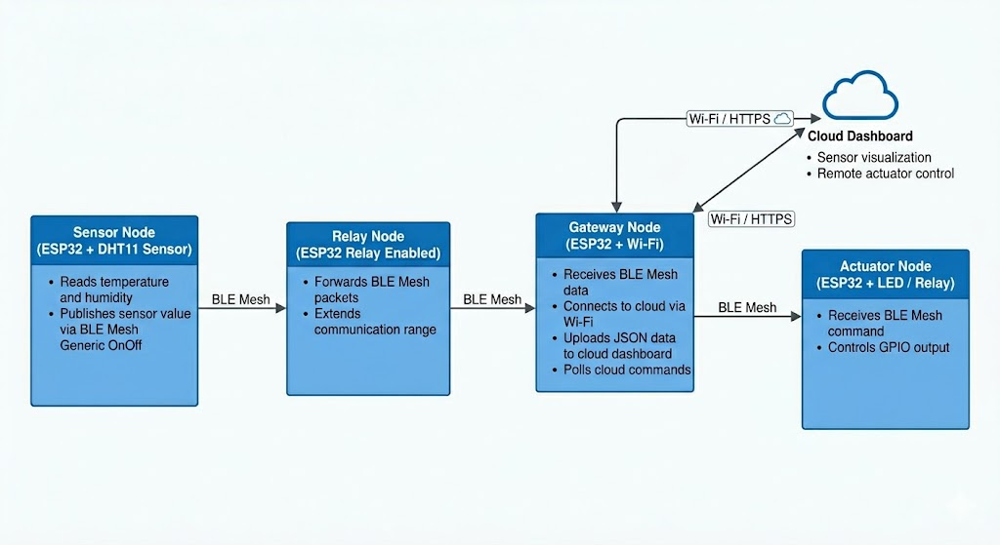

# ESP32 BLE Mesh Cloud IoT System

This project implements a distributed IoT architecture using multiple ESP32 nodes, where a sensor node reads environmental data and transmits it through BLE mesh communication to a gateway node. The gateway node connects to Wi-Fi and forwards the collected data to a cloud platform for storage and visualization. Based on cloud-side monitoring and control inputs, an actuator node receives remote commands and performs the required action, enabling end-to-end wireless sensing, cloud integration, and remote actuation within a multi-node embedded system.

System Architecture

The system consists of multiple ESP32 nodes performing dedicated roles. Sensor nodes collect environmental parameters, relay-capable nodes extend communication range through BLE mesh forwarding, the gateway node bridges local wireless communication with cloud connectivity, and the actuator node executes commands triggered remotely through the cloud interface.

## Hardware Used

* ESP32 development boards
* DHT sensor
* Relay module

## Features

* BLE mesh-based multi-node communication
* Wi-Fi gateway for cloud connectivity
* Remote sensor monitoring
* Cloud-controlled actuation
* Relay-assisted communication for distant nodes

## Applications

This type of architecture can be extended for smart homes, industrial monitoring, greenhouse automation, and distributed sensor networks.
## Repository Structure

* gateway_node: BLE mesh gateway and cloud communication
* sensor_node: DHT11 sensing and BLE mesh publishing
* relay_node: BLE mesh packet forwarding
* actuator_node: BLE mesh command reception and GPIO control
